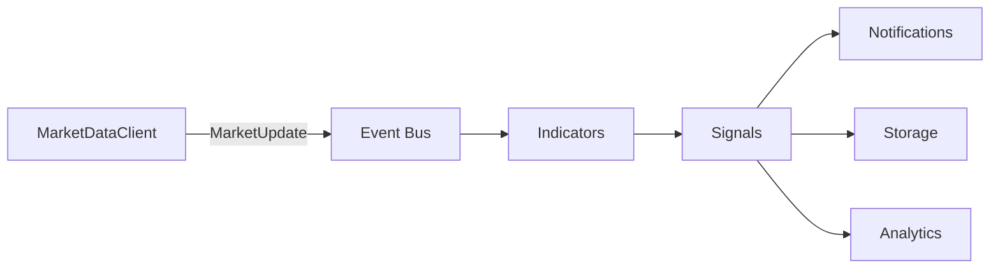

# Production Readiness Review

**Project:** TradingAgent v0.1.0  
**Review date:** 2026-07-08  
**Scope:** Foundation layer (config, logging, market data streaming). No indicators, signals, or trading logic reviewed or implemented.

---

## Executive Summary

TradingAgent is an early-stage platform with a **well-structured modular layout** and a working Alpaca live market data pipeline. The codebase demonstrates good separation of concerns via domain packages, provider protocols, and immutable configuration objects.

It is **not production-ready** today. Critical gaps include zero CI/CD, no dependency lockfile, split configuration paths, duplicated reconnect logic, and reliance on a private Alpaca SDK method. This review refactored error handling, logging, graceful shutdown, and test coverage without changing normal application behavior.

---

## Strengths

### Architecture and project structure

- **Clear domain boundaries.** Packages map to planned capabilities (`market`, `indicators`, `signals`, `notifications`, `storage`, `analytics`) with placeholders ready for phased delivery.
- **Thin entry point.** `main.py` delegates to `Application`, keeping bootstrap logic centralized in `app.py`.
- **Provider abstraction.** `MarketDataProvider` protocol and `MarketDataClient` decouple consumers from Alpaca-specific details.
- **Immutable configuration.** Frozen dataclasses with startup validation reduce runtime mutation bugs.
- **Normalized domain models.** `MarketUpdate`, `UpdateType`, and `ConnectionStatus` provide a stable contract for downstream modules.

### Code quality

- **Consistent module logging.** All modules use `logging.getLogger(__name__)` after centralized setup.
- **Type hints throughout.** Python 3.12+ syntax (`Settings | None`, `AsyncIterator`) used consistently.
- **Pure mapping layer.** `mapper.py` contains side-effect-free transformations — easy to test and extend.
- **Explicit SSL handling.** `networking.py` documents and resolves macOS certificate issues via certifi.

### Resilience (post-refactor)

- **Graceful shutdown.** SIGINT/SIGTERM handlers request a clean client stop via the asyncio event loop.
- **Idempotent stop.** `MarketDataClient.stop()` is safe to call multiple times.
- **Consumer fault isolation.** A failing consumer no longer aborts the update pipeline.
- **Status callback tracking.** Provider status tasks are tracked, logged on failure, and cancelled on shutdown.
- **Shared exception hierarchy.** `ConfigurationError`, `MarketDataError`, and `TradingAgentError` in `core/exceptions.py`.

### Testing (added in this review)

- 20 unit tests covering settings validation, Alpaca config parsing, domain mapping, model formatting, and client lifecycle with a fake provider.
- `pytest` and `pytest-asyncio` added as optional dev dependencies.

---

## Weaknesses

### Configuration

- **Split across three paths:** `Settings` (app), `AlpacaSettings` (provider), and raw `os.getenv("MARKET_DATA_PROVIDER")` in the factory.
- **`load_dotenv()` called twice** — once in each loader — with no single composition root for all env vars.
- **No secrets management.** Credentials read directly from environment; no Vault, AWS Secrets Manager, or similar integration.
- **`environment` setting unused** for feature flags or config profiles beyond third-party log suppression.

### Streaming and async

- **Unbounded queue.** `asyncio.Queue` in `MarketDataClient` has no max size; a slow consumer can cause unbounded memory growth.
- **Sequential consumer dispatch.** Consumers run one after another; a slow async consumer blocks subsequent consumers.
- **Dual reconnect layers.** `AlpacaLiveStream._run_forever()` (fixed 1s delay) and `AlpacaMarketDataProvider.start()` (exponential backoff up to 60s) both handle reconnection. Failure modes are hard to reason about and timing differs by exit path.
- **Private SDK API.** Provider calls `self._stream._run_forever()` — an underscore-prefixed Alpaca SDK method that may break on upgrades.

### Observability

- **Plain-text logging only.** No structured JSON logs, correlation IDs, or metrics.
- **No health endpoint.** No way for orchestrators (Kubernetes, systemd) to verify liveness.
- **Per-update logging moved to DEBUG** (improvement), but no sampling or rate limiting for high-throughput symbols.

### Operations

- **No CI/CD pipeline.** No automated test, lint, or type-check runs on push.
- **No dependency lockfile.** `requirements.txt` and `pyproject.toml` specify minimum versions only; builds are not reproducible.
- **No deployment artifacts.** No Dockerfile, systemd unit, or process manager configuration.
- **No console entry point.** Must run `python main.py` from project root; no `[project.scripts]` in `pyproject.toml`.

### Documentation drift

- `README.md` lists market data as "future" though it is implemented and wired in `app.py`.
- `PROJECT.md` Phase 2 checkboxes do not reflect partial market data completion.

---

## Future Improvements

### Near term (before adding trading logic)

1. **Unify configuration** — extend `Settings` with market data fields; inject into `Application` and `create_market_data_client()`.
2. **Consolidate reconnect logic** — choose one layer (websocket or provider) as the single source of retry behavior.
3. **Replace private SDK usage** — wrap Alpaca streaming with a public API or an explicit adapter that documents the coupling.
4. **Add CI** — GitHub Actions running `pytest`, `ruff`, and `mypy` on every push.
5. **Pin dependencies** — generate a lockfile with `uv lock` or `pip-tools`.
6. **Add bounded queue with backpressure** — `asyncio.Queue(maxsize=N)` with a drop/overflow policy.
7. **Parallel consumer dispatch** — `asyncio.gather` with error isolation for independent consumers.

### Medium term (production deployment)

8. **Structured logging** — JSON formatter for production; human-readable for development.
9. **Health and readiness endpoints** — HTTP `/health` returning connection status and uptime.
10. **Metrics** — Prometheus counters for updates received, reconnects, consumer errors.
11. **Secrets management** — integrate with a secrets backend; never log credential-adjacent fields.
12. **Docker + compose** — containerized deployment with env-file injection.
13. **Integration tests** — mock Alpaca WebSocket server for end-to-end provider tests.

### Long term (platform maturity)

14. **Wire domain pipeline** — indicators → signals → notifications → storage per `PROJECT.md` roadmap.
15. **Event bus** — decouple producers and consumers with an internal pub/sub or queue system.
16. **Multi-provider support** — additional `MarketDataProvider` implementations behind the same protocol.
17. **Distributed tracing** — OpenTelemetry spans across streaming, signal generation, and notification delivery.

---

## Technical Debt

| Item | Severity | Location | Notes |
|------|----------|----------|-------|
| Split configuration | High | `config/settings.py`, `alpaca/config.py`, `market/client.py` | Three independent env loading paths |
| Dual reconnect loops | Medium | `networking.py`, `provider.py` | Compounded delays; hard to test |
| Private SDK method `_run_forever` | High | `provider.py` | Fragile across alpaca-py upgrades |
| Unbounded update queue | Medium | `market/client.py` | Memory risk under load |
| No lockfile | Medium | `pyproject.toml`, `requirements.txt` | Non-reproducible builds |
| Documentation drift | Low | `README.md`, `PROJECT.md` | Misleading for new contributors |
| Empty domain packages | Low | `indicators/`, `signals/`, etc. | Expected per roadmap; add README stubs |
| `websockets` undeclared | Low | `networking.py` | Transitive via alpaca-py; should be explicit if imported directly |
| Windows signal handling | Low | `app.py` | SIGTERM handler not supported; SIGINT falls back to KeyboardInterrupt |

---

## Architectural Recommendations

### 1. Single composition root

`Application` should own all settings and inject them into every subsystem:

```
Application
  ├── Settings (unified)
  ├── Logging
  ├── MarketDataClient(settings.market)
  └── (future) IndicatorEngine, SignalGenerator, Notifier, Storage
```

Avoid module-level `load_dotenv()` calls outside the composition root.

### 2. Event-driven pipeline

As domain modules are added, prefer an internal event bus over direct callback chains:



This avoids tight coupling and allows independent scaling of consumers.

### 3. Provider adapter pattern

Wrap Alpaca SDK internals behind an explicit adapter class:

```
MarketDataProvider (protocol)
  └── AlpacaMarketDataProvider
        └── AlpacaStreamAdapter  ← owns _run_forever and SDK version coupling
              └── AlpacaLiveStream (networking hooks)
```

SDK upgrades affect only the adapter layer.

### 4. Layered error handling

| Layer | Responsibility |
|-------|----------------|
| Config | Raise `ConfigurationError` at startup; fail fast |
| Provider | Reconnect on transient network errors; emit `ConnectionStatus.ERROR` on fatal |
| Client | Isolate consumer errors; never let a callback crash the stream |
| Application | Catch shutdown signals; ensure `stop()` in `finally` |

### 5. Testing strategy

| Layer | Test type | Priority |
|-------|-----------|----------|
| Config, mapper, models | Unit (pure functions) | Done |
| MarketDataClient | Unit (fake provider) | Done |
| Alpaca provider | Integration (mock WebSocket) | Next |
| Application | Integration (signal handling) | Next |
| End-to-end | Smoke test with paper credentials | Before staging |

### 6. Production logging policy

| Event | Level |
|-------|-------|
| Application start/stop | INFO |
| Connection status changes | INFO |
| Individual market updates | DEBUG |
| Reconnect attempts | WARNING |
| Consumer failures | ERROR |
| Fatal subscription errors | ERROR + exception traceback |

---

## Changes Made in This Review

The following refactors were applied. Normal streaming behavior is unchanged; error-path and observability behavior is improved.

| Area | Change |
|------|--------|
| `core/exceptions.py` | Added shared exception hierarchy |
| `config/settings.py` | Raises `ConfigurationError` instead of bare `ValueError` |
| `alpaca/config.py` | Same; improved docstrings |
| `app.py` | SIGINT/SIGTERM graceful shutdown via asyncio signal handlers |
| `market/client.py` | Idempotent stop, consumer error isolation, DEBUG-level update logging, `ConfigurationError` for unknown provider |
| `alpaca/provider.py` | Status task tracking, drain on stop, improved reconnect log messages |
| `alpaca/networking.py` | Extracted `_reconnect_after_error` helper; documented dual-layer reconnect |
| `infrastructure/logging.py` | Suppress noisy third-party loggers in production |
| `pyproject.toml` | Added `[project.optional-dependencies.dev]` and pytest config |
| `tests/` | 20 unit tests across config, mapper, models, and client |

---

## Verdict

**Current state:** Suitable for local development and Phase 1 iteration.  
**Production readiness:** Not ready. Address configuration unification, SDK coupling, CI/CD, and observability before deploying to a live environment.  
**Recommended next step:** Unify configuration and add CI — then proceed with the indicator/signal pipeline per `PROJECT.md`.
