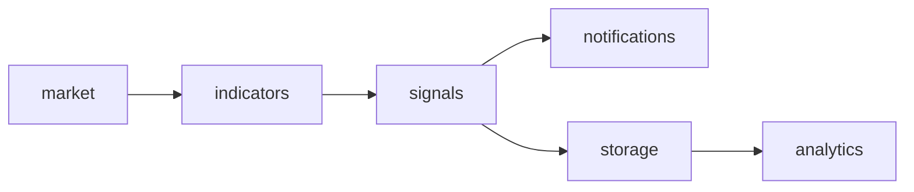
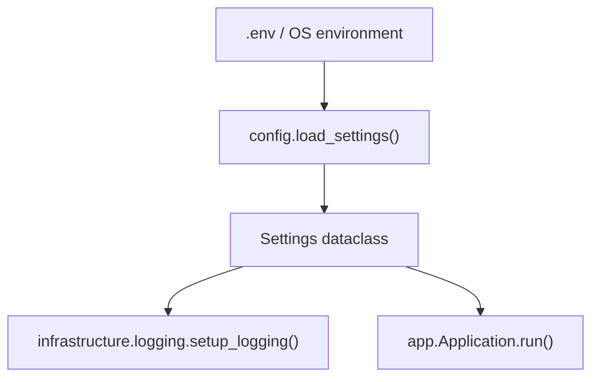

# Project Architecture

This document describes the structure, design decisions, and phased roadmap for **Trading Agent** — an options trading signal platform.

## Purpose

Trading Agent generates **signals only**. It will:

- Monitor live market data
- Calculate technical indicators
- Produce BUY and SELL signals
- Send notifications
- Store signal history
- Produce weekly analytics

It will **never** automatically execute trades.

---

## Design principles

| Principle | Rationale |
|-----------|-----------|
| **Thin entry point** | `main.py` only bootstraps; orchestration lives in `app.py`. |
| **src layout** | Package code lives under `src/trading_agent/` to avoid accidental imports from the repo root and to scale cleanly past 100+ files. |
| **Immutable config** | Settings are loaded once at startup into a frozen dataclass. |
| **Explicit logging** | Python `logging` module, configured centrally — no `print()`. |
| **Domain separation** | Each bounded context gets its own package. |
| **No premature implementation** | Future packages exist as empty modules until their phase begins. |

---

## Folder structure

```
TradingAgent/
├── main.py                          # Entry point (bootstrap only)
├── pyproject.toml                   # Package metadata and editable install
├── requirements.txt                 # Pinned runtime dependencies
├── .env.example                     # Documented environment template
├── .gitignore
├── README.md                        # Quick start for developers
├── PROJECT.md                       # This file
└── src/
    └── trading_agent/
        ├── __init__.py              # Package version
        ├── app.py                   # Application orchestrator
        ├── config/                  # Environment-based configuration
        ├── infrastructure/        # Cross-cutting concerns (logging, etc.)
        ├── core/                    # Shared domain types and exceptions
        ├── market/                  # Market data providers and feeds
        ├── indicators/              # Technical indicator calculations
        ├── signals/                 # Signal generation rules
        ├── notifications/           # Alert delivery channels
        ├── storage/                 # Signal history persistence
        └── analytics/               # Weekly reports and metrics
```

---

## Module responsibilities

### `main.py`

Single responsibility: create an `Application` instance and call `run()`. No business logic.

### `trading_agent.app`

The **application orchestrator**. Responsibilities:

- Load configuration
- Initialize logging
- Wire domain services together (future phases)
- Define the application lifecycle (`run`, graceful shutdown)

This is the composition root — the one place that knows how modules connect.

### `trading_agent.config`

Loads and validates environment variables into a `Settings` dataclass. Uses `python-dotenv` so local development can read from a `.env` file while production injects variables directly.

Current settings:

| Variable | Default | Description |
|----------|---------|-------------|
| `APP_NAME` | `TradingAgent` | Application display name |
| `APP_ENV` | `development` | `development`, `staging`, or `production` |
| `LOG_LEVEL` | `INFO` | Python log level |

### `trading_agent.infrastructure`

Cross-cutting technical concerns that are not business logic:

- **logging** — centralized log format and handler setup
- Future: HTTP client wrappers, schedulers, retry utilities

Keeping these separate prevents domain packages from depending on each other for infrastructure code.

### `trading_agent.core` (future)

Shared building blocks used by multiple domain packages:

- Domain enums (e.g., `SignalType`, `OptionStrategy`)
- Base exceptions
- Common dataclasses / protocols

No feature logic — only shared vocabulary.

### `trading_agent.market` (future)

Market data ingestion:

- Live price feeds
- Options chain snapshots
- Historical candle data
- Provider abstractions (e.g., broker API, third-party data vendor)

### `trading_agent.indicators` (future)

Pure calculation functions:

- RSI, MACD, moving averages, etc.
- Input: price series; output: indicator values
- No side effects, no I/O — easy to unit test

### `trading_agent.signals` (future)

Signal generation rules:

- Combines market data + indicators
- Emits structured BUY/SELL signal objects
- Strategy-specific logic lives here

### `trading_agent.notifications` (future)

Delivers signals to users:

- Email, SMS, push notifications, Slack/webhooks
- Templates and formatting
- Does not decide *what* to signal — only *how* to notify

### `trading_agent.storage` (future)

Persists signal history:

- Database models and repositories
- Query interfaces for analytics
- No signal logic

### `trading_agent.analytics` (future)

Scheduled reporting:

- Weekly performance summaries
- Signal accuracy metrics
- Export to Google Sheets or other formats

---

## Data flow (target architecture)



Each arrow represents a one-way dependency. Lower layers never import from higher layers.

---

## Configuration flow



---

## Phased roadmap

### Phase 0 — Foundation (current)

- [x] Project structure and package layout
- [x] Configuration module (`.env` + `Settings`)
- [x] Logging setup
- [x] Application bootstrap (`main.py` → `app.py`)
- [x] Documentation (`README.md`, `PROJECT.md`)

### Phase 1 — Core domain types

- Shared enums, dataclasses, exceptions in `core/`
- Signal model definition

### Phase 2 — Market data

- Provider interface in `market/`
- First data source integration
- Live feed polling or streaming

### Phase 3 — Indicators

- Indicator library in `indicators/`
- Unit tests against known values

### Phase 4 — Signal generation

- Strategy rules in `signals/`
- End-to-end: data → indicators → signal

### Phase 5 — Notifications

- Notification channels in `notifications/`
- Signal → alert pipeline

### Phase 6 — Storage

- Database schema in `storage/`
- Signal history persistence

### Phase 7 — Analytics

- Weekly report generation in `analytics/`
- Optional Google Sheets export

---

## Running locally

```bash
python3 -m venv .venv
source .venv/bin/activate
pip install -e .
cp .env.example .env
python main.py
```

---

## Adding a new module

1. Create a package under `src/trading_agent/<name>/` with an `__init__.py`.
2. Document its responsibility in this file.
3. Wire it into `app.py` — never into `main.py`.
4. Add tests under `tests/<name>/` when the phase begins (test directory not yet created).

---

## Conventions

- Python 3.12+, PEP 8, type hints on all public functions
- Dataclasses for structured data; `Enum` for fixed sets
- `logging.getLogger(__name__)` in every module
- Functions stay small; one clear responsibility each
- No placeholder or stub implementations in production code paths
